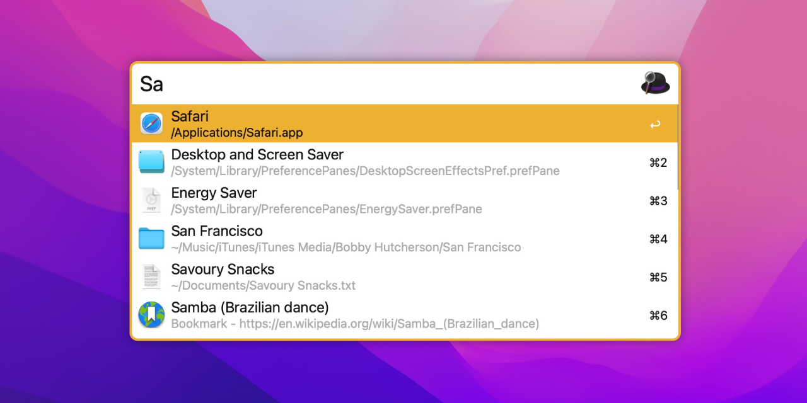
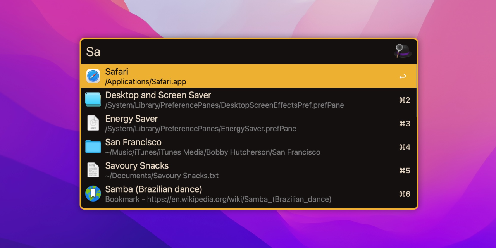

# Black Golden Theme for Alfred

A black golden light / dark theme for [Alfred 5](https://www.alfredapp.com).

## How to Install

Install directly from the Alfred site:

- [Black Golden Light Theme](https://www.alfredapp.com/extras/theme/HjAyXfYmUv/)
- [Black Golden Dark theme](https://www.alfredapp.com/extras/theme/3kLMgkT7RA/)

****
Or Install Manually:

## Info

#### Suggested usage:
Hide the Alfred hat icon in the input by going to  `Appearance > Options > Hide hat on Alfred window`.

#### Note:
Using custom themes requires the [Alfred Powerpack](https://www.alfredapp.com/powerpack/).

## License
[MIT License](https://github.com/namzo/alfred-theme-moderna/blob/master/LICENSE)